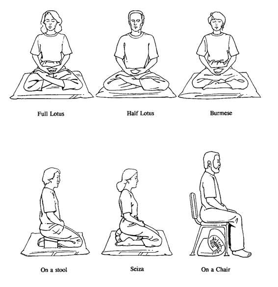

\newpage

# Kurseinheit 2 - Wahrnehmung, Umgang mit Herausforderungen

## Zusammenfassung des Kursabends

Wir haben mit einigen Yogaübungen im Stehen begonnen und im Anschluss den __Body Scan__ geübt.

Danach haben wir uns über unsere Erfahrungen mit der __Achtsamkeitspraxis__, dem Üben zuhause und den __auftretenden Schwierigkeiten__ ausgetauscht.

Ebenso haben wir uns über die anderen Übungen der ersten Kurswoche, die Neun-Punkte-Übung und das achtsame Essen, ausgetauscht.

Neben der Neun-Punkte-Übung gibt es ebenfalls Kippbilder, die zeigen, dass jeder seine Erfahrungen, sein Wissen und seine Verhaltensmuster in Situationen hereinbringt und diese die individuelle Wahrnehmung der Situation beeinflussen.

{width=440 height=340}

Zum Abschluss haben wir die Sitzmeditation mit Achtsamkeit auf den Atem kennengelernt sowie einige Sitzhaltungen. Jeder von Euch kann versuchen herauszufinden, in welcher Haltung die Meditation am angenehmsten ist.

\newpage

## Übungen für zuhause

- __Body Scan__ nach Anleitung an mindestens sechs Tagen in der Woche üben
- __Sitzmeditation mit Achtsamkeit auf den Atem__
- __Kalender angenehmer Ereignisse ausfüllen (ein Eintrag pro Tag)__, wenn es an einem Tag nichts Angenehmes gibt, tragt ihr an diesem Tag ganz achtsam nichts ein
- Eine __Alltagstätigkeit auswählen__, bei der Du in dieser Woche besonders achtsam
sein möchtest (z.B. Zähne putzen, den Müll wegbringen, duschen, das Haustier
füttern usw.).

\newpage

## Sitzmeditation mit Achtsamkeit auf den Atem

Suche Dir einen Ort, an dem Du für 5 bis 10 Minuten ungestört praktizieren kannst.

Setze Dich bequem hin und versuche eine Haltung zu finden, in der Du so aufrecht und entspannt wie möglich sitzen kannst.

Wenn es für Dich angenehm ist, schließe Deine Augen. Richte nun Deine Aufmerksamkeit auf den einströmenden und ausströmenden Atem und auch auf die Zeit dazwischen.

Spüre, wo Du den Atem am intensivsten wahrnimmst, bei vielen ist dies die Bauchdecke, der Brustkorb oder sind dies die Nasenflügel. Versuche, dort mit Deiner Aufmerksamkeit zu verweilen.

Wenn Du bemerkst, dass Deine Aufmerksamkeit Gedanken folgt, nimm wahr, was Dich beschäftigt und kehre danach wieder zu Deinem Atem zurück.

Es ist völlig normal, dass Deine Gedanken immer und immer wieder auftauchen. Versuche, dem regelmäßigen Wechsel zwischen Gedanken und der Aufmerksamkeit auf den Atem mit Geduld zu begegnen.

\newpage

## Meditationshaltungen

{width=440 height=453}

\newpage

> __Ein Vorgeschmack von Glück__
>
> Obwohl Berta Young schon dreißig war, gab es in ihrem Leben immer noch Augenblicke wie diesen, wo sie lieber rennen möchte, anstatt zu gehen, über das Straßenpflaster hüpfen, einen Reifen drehen, etwas in die Luft werfen und wieder auffangen, oder stehen bleiben und – ohne Grund – lachen, einfach ohne Grund. … Was kann man machen, wenn man dreißig ist und beim Einbiegen in die eigene Straße unversehens von einem Gefühl der Glückseligkeit – absoluter Glückseligkeit! – erfasst wird, als hätte man plötzlich ein großes Stück von dieser leuchtenden Spätnachmittagssonne verschluckt, das in der Brust ein feuriges Gefühl hervorruft und einen kleinen Funkenregen in jede Zelle, jeden Finger und jede Zehe sendet?
>
> _Katherine Mansfield, Seligkeit_
