\newpage

## Yoga im Liegen {#yoga-im-liegen}

Im folgenden sind einige typische Übungssequenzen für das Yoga im Liegen dargestellt, wie sie im Rahmen des MBSR-Kurses praktiziert werden.

<!---
\newpage

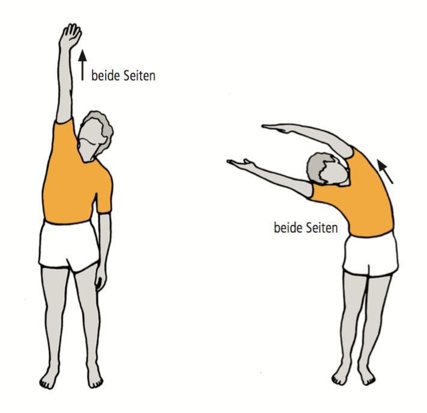{width=400 height=337}

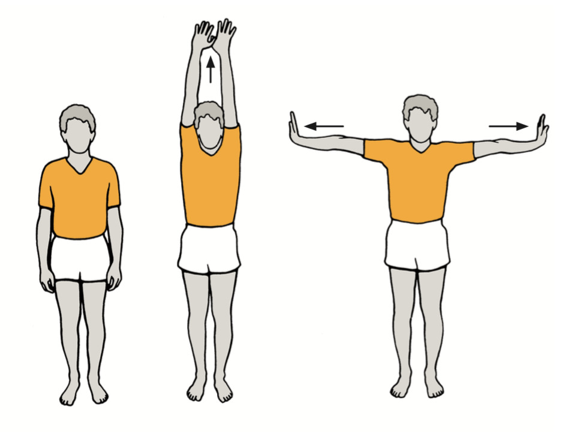{width=400 height=268}

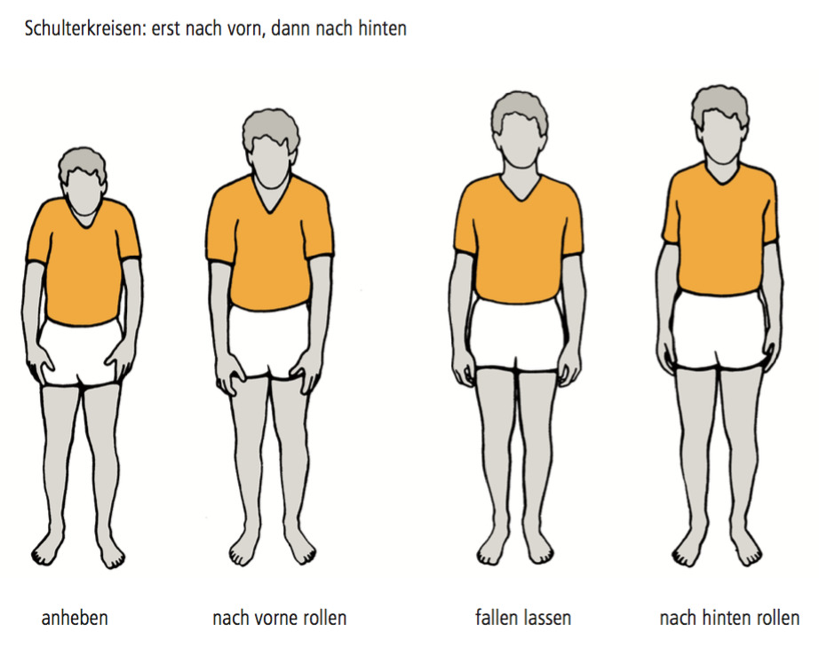{width=400 height=268}

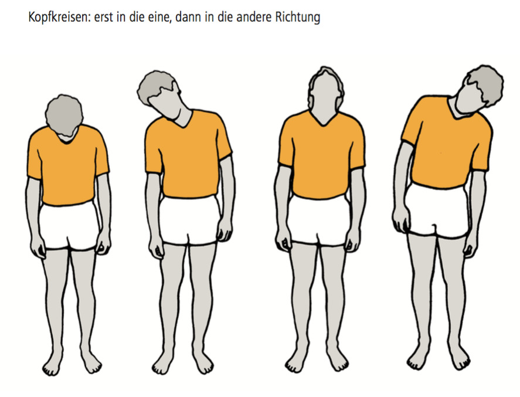{width=400 height=268}

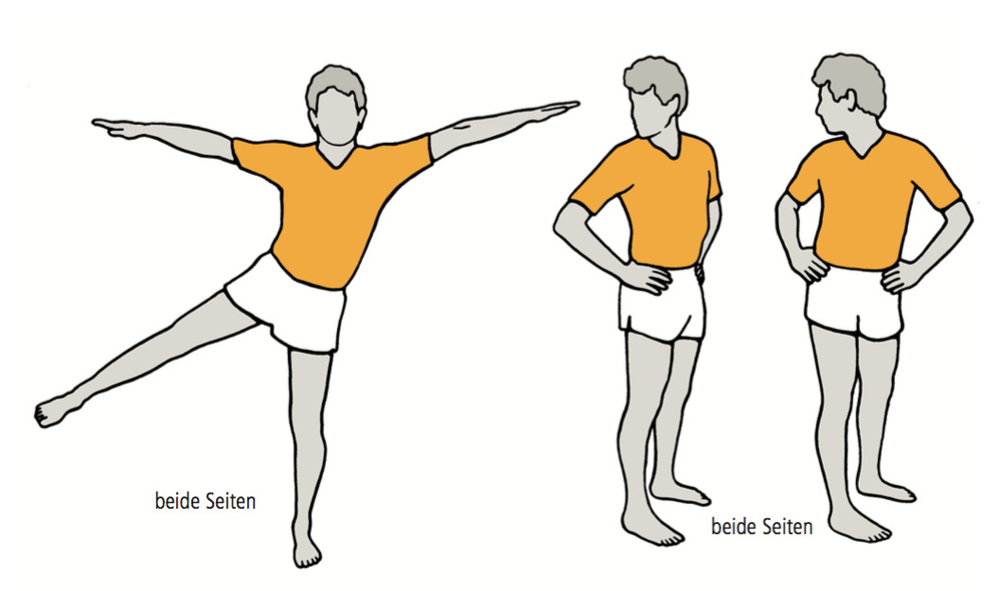{width=400 height=268}
-->
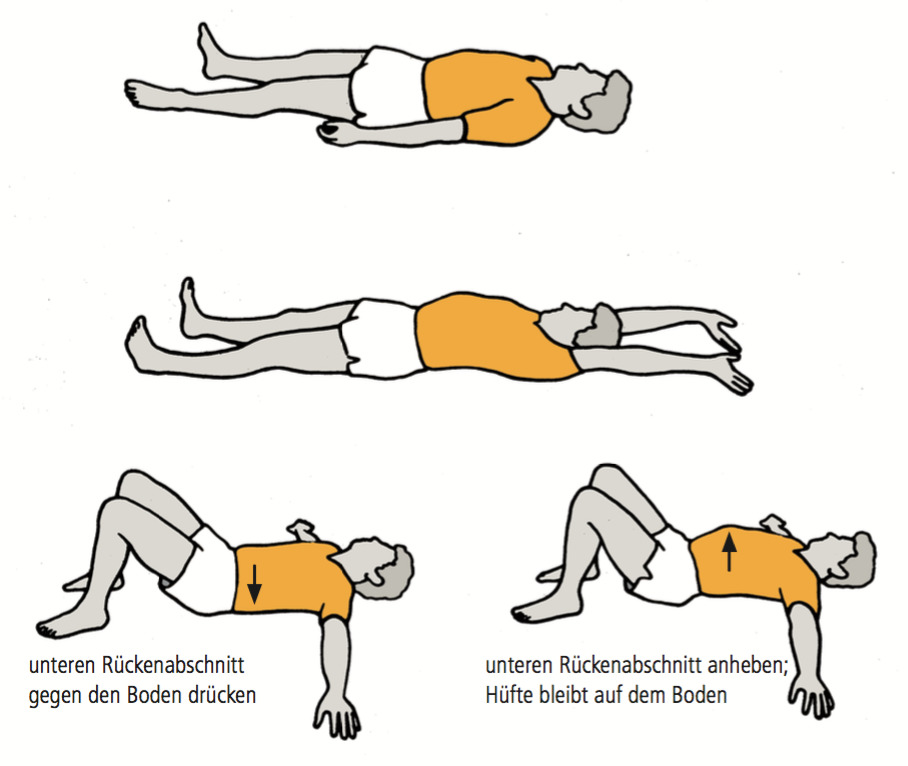{width=400 height=337}

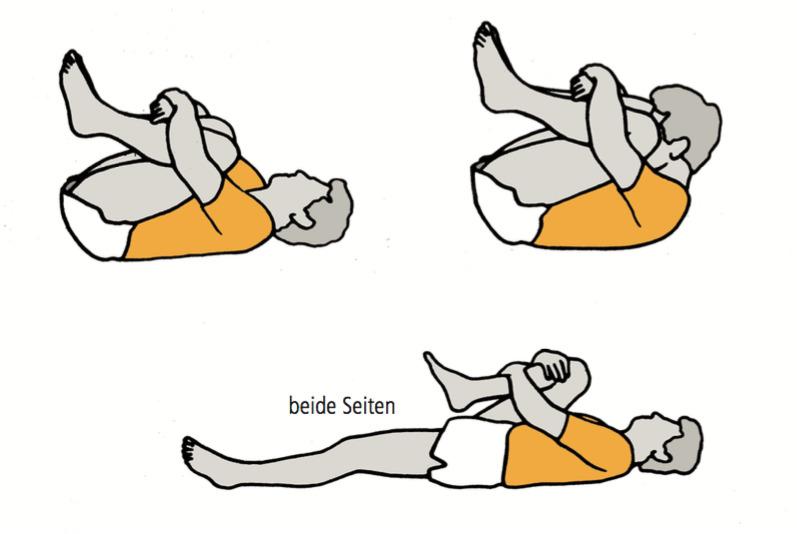{width=400 height=268}

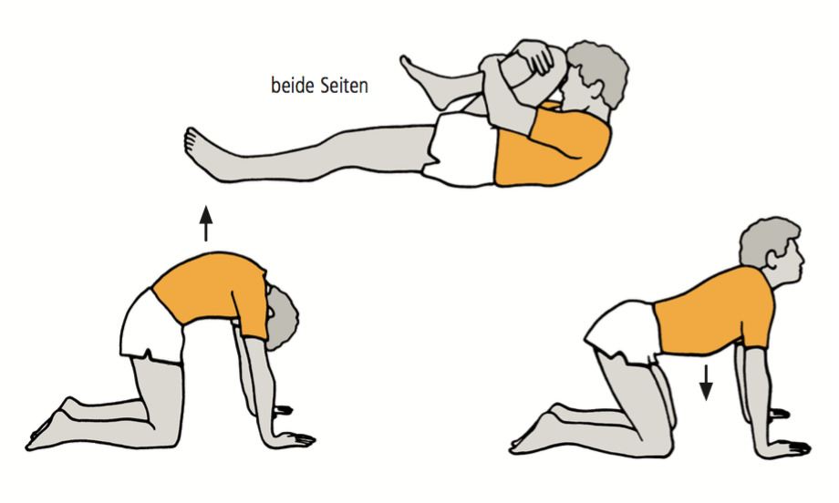{width=400 height=240}

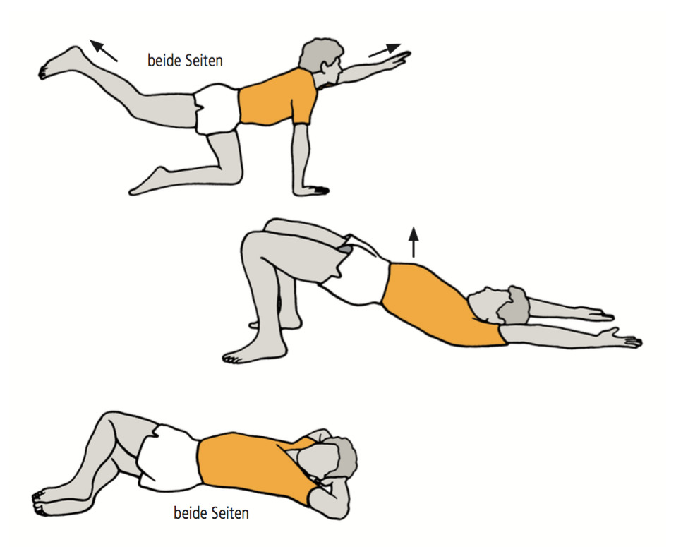{width=400 height=323}

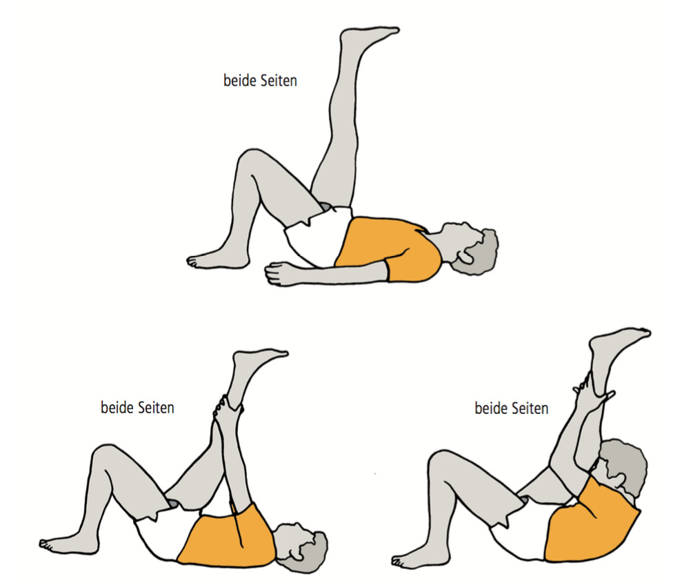{width=400 height=342}

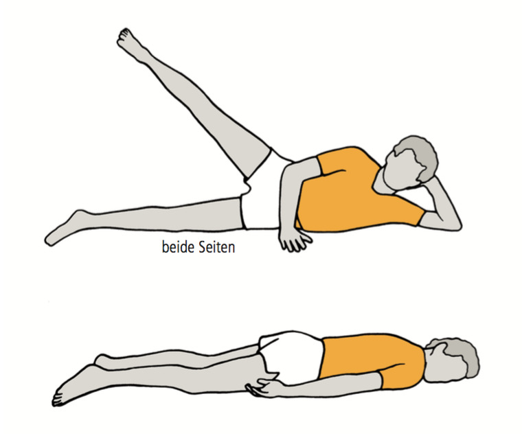{width=400 height=335}

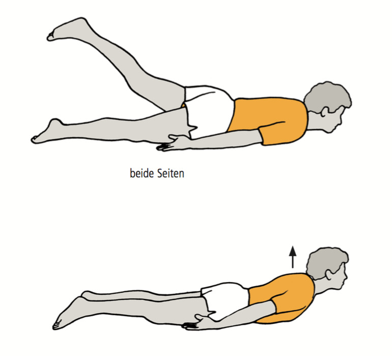{width=400 height=362}

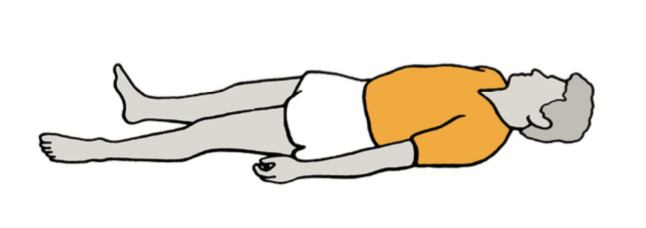{width=400 height=141}

\newpage
