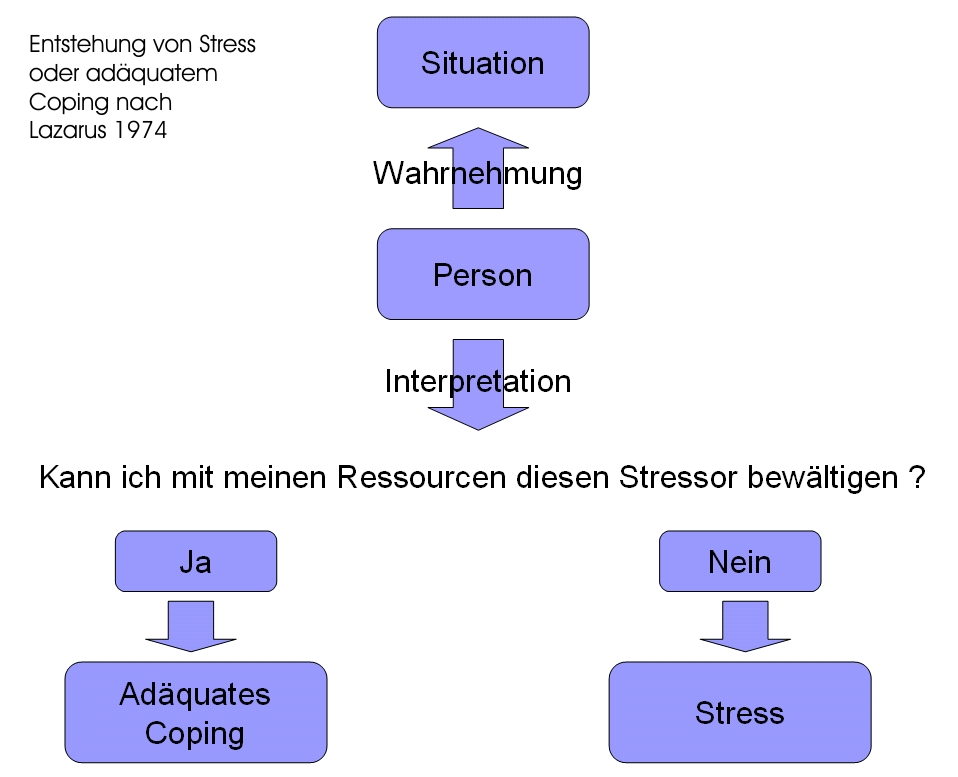
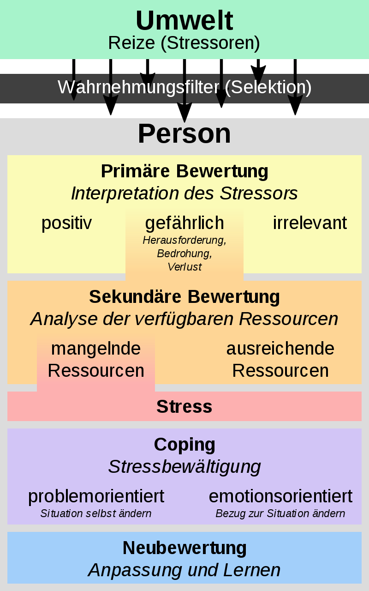
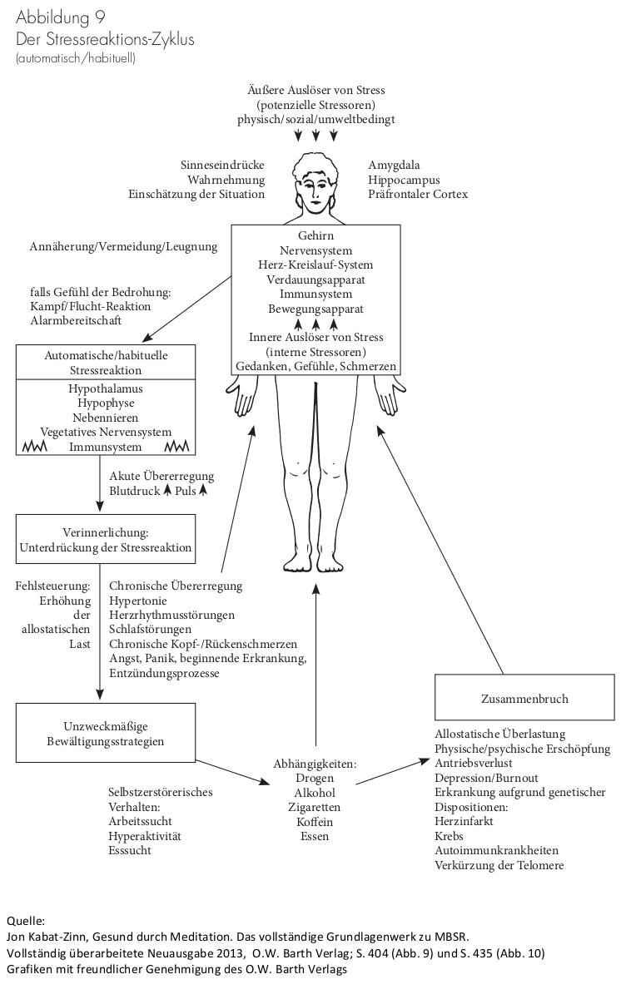
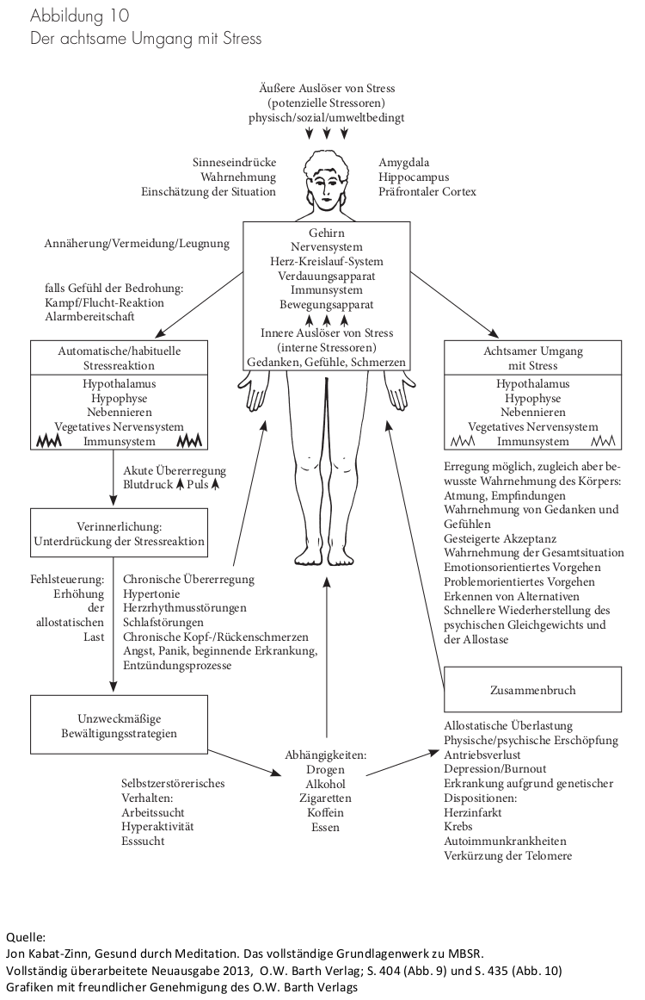

\newpage

## Stress

### Was ist eigentlich Stress?

>__*Stress*__ (engl. für ‚Druck, Anspannung‘; lat. stringere[1] ‚anspannen‘) bezeichnet zum einen durch spezifische äußere Reize (Stressoren) hervorgerufene psychische und physische Reaktionen bei Lebewesen, die zur Bewältigung besonderer Anforderungen befähigen, und zum anderen die dadurch entstehende körperliche und geistige Belastung.

### Das Stressmodell von Richard Lazarus

Es gibt mehrere Modelle, die Stress beschreiben, ein sehr verbreitetes ist das von Richard Lazarus. In einer vereinfachten Form (folgende Grafik) nehmen Personen Situationen wahr (genau genommen die Reize aus den Situationen) und bewerten diese. Wenn diese Situation als Stressor ( = Stress auslösender Reiz) bewertet wird, dann hängt das Eintreten von Stress davon ab, ob ich mit meinen Ressourcen diesen Stressor bewältigen kann oder nicht.

{width=440 height=357}

Das vollständige Modell von Lazarus (folgende Grafik) zeigt darüber hinaus, dass es zum einen mehrere Möglichkeiten gibt, Stressoren zu bewerten (positiv, gefährlich, irrelevant), es zum anderen durch Erleben von Stress oder Erleben von Stressbewältigung eine Neubewertung der Situation gibt, sodass in Zukunft diese Situation anders bewältigt wird.

Ausreichende Ressourcen ermöglichen das Coping, die Stressbewältigung, dadurch, dass entweder etwas an der Situation selbst geändert werden kann (problemorientiert) oder etwas am Bezug zur Situation geändert werden kann (emotionsorientiert).

{width=440 height=704}

Achtsamkeit setzt an verschiedenen Stellen des Modells an und begünstigt die primäre und sekundäre Bewertung des Reizes sowie die emotionsorientierte Stressbewältigung und führt darüber zu einer positiveren Neubewertung.

### Der Stress-Reaktionszyklus

Was passiert, wenn wir in Stress geraten?

Eine sehr ausführliche Beschreibung zum Thema Stress findest Du in dem Kapitel "III Stress, 19. Gefangen in der Stressreaktion" aus _Gesund durch Meditation_" von Jon Kabat-Zinn.

Du findest hier eine zusammengefasste Darstellung des Stress-Reaktionszyklus.

Unsere unbewusst und gewohnheitsmäßig ablaufenden Reaktionen auf
Stressauslöser samt unserer unzweckmäßigen Bewältigungsversuche bestimmen in hohem Grade, unter wie viel Druck wir geraten. Impulsives Reagieren auf vermeintlich
existenzielle Bedrohungen verstärkt meistens den Stress, weil es eigentlich harmlose Dinge mit der Zeit häufig erst in echte Probleme verwandelt.

Neben den äußeren Auslösern von Stress gibt es auch innere Auslöser von Stress.

__Äußere Auslöser__

- Umwelt (Lärm, Hektik)
- materiell (finanzielle Schwierigkeiten)
- gesellschaftlich (Anerkennung, Zugehörigkeit)
- sozial (Beziehung, Partnerschaft)
- emotional (Tod nahestehender Menschen)
- ökonomisch (unsichere berufliche Situation)
- politisch (Verfolgung, Krieg)

__Innere Auslöser__

- Gedanken
- Gefühle
- körperliche Auslöser (Schmerzen)

Wenn jemand daran glaubt, schwer krank zu sein, ohne dass er es wirklich ist, kann dieses für ihn ein Auslöser von intensivem Stress sein.

Geraten wir plötzlich in eine extreme Stresssituation, in
der wir uns physisch oder psychisch in unserem ganzen
Sein, unserer Identität oder sozialen Stellung bedroht
sehen, gibt es zwei Möglichkeiten.

Verschwindet die Bedrohung oder erweist sie sich bei Nachprüfung als
gegenstandslos, dann erfolgt entweder eine schwache oder
gar keine Reaktion.

Bewerten wir den Stressauslöser jedoch weiter als existenziell bedrohlich oder löst er auf andere Weise heftige Emotionen aus, setzt normalerweise eine automatisch ablaufende Alarmreaktion ein.

Diese Alarmreaktion schafft bei akuter Gefahr die physiologischen Voraussetzungen für eine Kampf-oder-Flucht-Reaktion (fight or flight response). Diese führt häufig dazu, impulsiv und unreflektiert zu handeln.

Dabei steuert das vegetative Nervensystem die Veränderungen auf körperlicher und emotionaler Ebene. Das vegetative Nervensystem besteht aus dem _sympathischen Nervensystem_, welches die physiologischen Abläufe beschleunigt, und dem _parasympathischen Nervensystem_, welches die physiologischen Abläufe verlangsamt. Darüber wird die Erregung und Erholung des Organismus gesteuert.

Über das limbische System (den Sitz der Emotionen) des Gehirns und den Hypothalamus werden die Vorgänge im vegetativen Nervensystem beeinflusst. Über das Achtsamkeitstraining trainieren wir das Zusammenspiel von _präfrontalem Cortex_ (menschliche intellektuelle Fähigkeiten wie vorausschauendes Denken, Impulskontrolle, bewusste Entscheidungsfindung, langfristige Planung) und limbischem System.

Da Kampf oder Flucht in unserer Gesellschaft nicht möglich und auch nicht akzeptiert ist, findet diese ganze Reaktion nur nach innen statt. Nach außen wird überspielt und Gelassenheit vorgetäuscht.

__*Damit werden die körpereigenen Mechanismen zum Stressabbau in weiten Teilen ausser Kraft gesetzt.*__

Unzweckmäßige Stressbewältigungsstrategien wie Kaschieren, Leugnen, Schönfärberei und Arbeitswut führen zu mehr Stress.

Alkohol, Nikotin, Drogen, Trost-Essen, Medikamente sind als Stressbewältigung ungeeignet, da sie auf der Annahme basieren, dass Unzufriedenheit mit den Gegebenheiten durch Einnahme von Substanzen zu lösen sei.

Man kann den Kreislauf aus Stressauslöser, Stressreaktion,
fehlgeleiteten Versuchen zur Stabilisierung von Körper und
Geist, erhöhtem Stress und weiteren untauglichen
Bewältigungsversuchen über viele Jahre hinweg
aufrechterhalten, was zu einem Zusammenbruch wie Depression oder Burnout führen kann.

{width=440 height=702}

<!--
{width=440 height=681}
-->

Achtsamkeit gibt uns bessere Optionen für Gesundheit und Wohlbefinden an die Hand, da wir anstelle automatisierter Muster auf bewusste Entscheidungen in den jeweiligen Situationen zurückgreifen können.

\newpage
